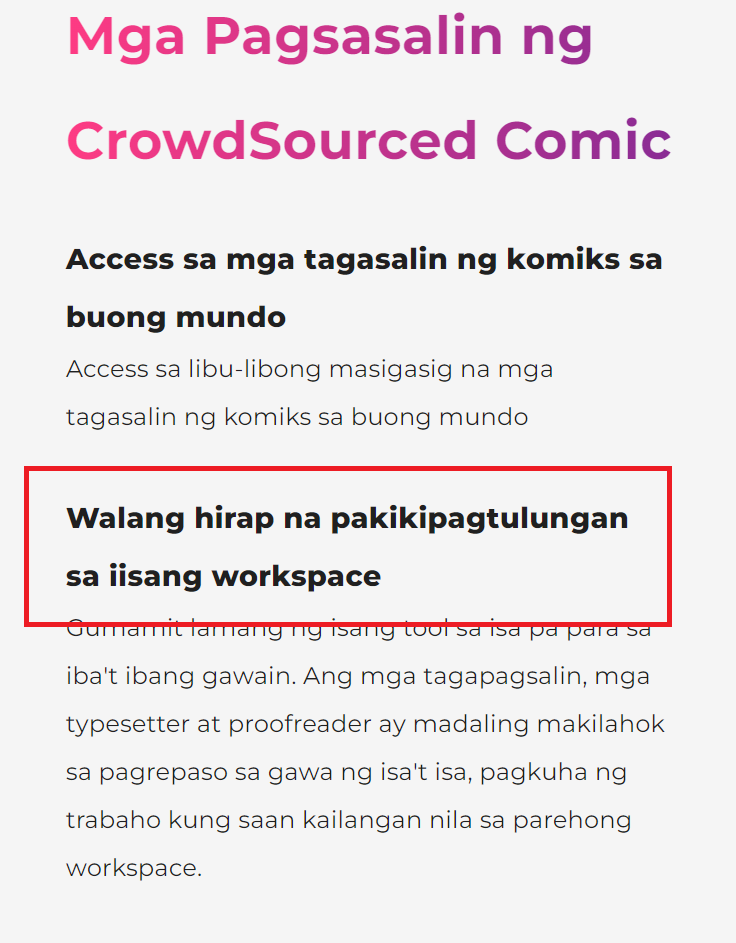
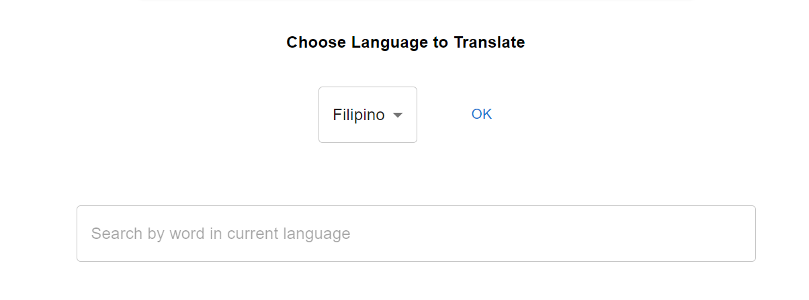
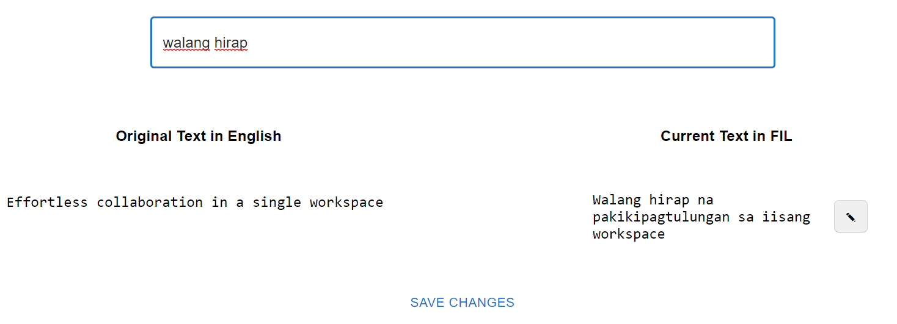
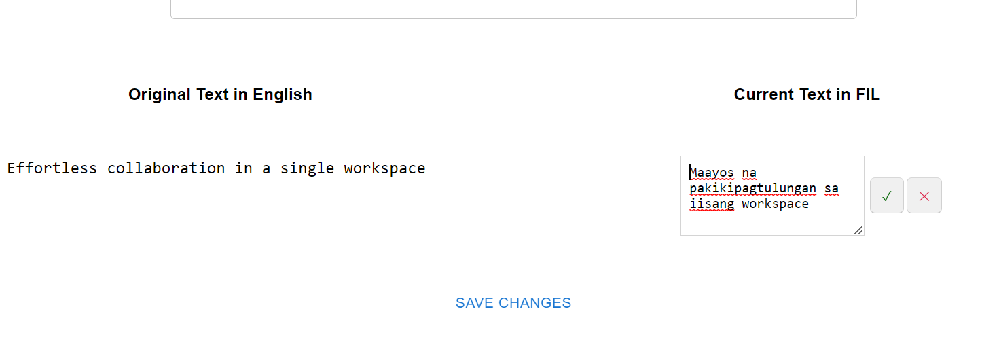

# site-translation

1.  **Found texts that doesn't seem quite right?**

Epico.ink displays its texts in 8 languages. Most of the texts in the site are machine-translated. The purpose of this project is to have a dedicated client-only site for translators to accurately replace erroneous texts made using machine translation.

Once a user has requested for changes in texts, it will automatically create a pull request to this repository. Once reviewed and merged, the translator's texts are displayed in our main site.

2. **How do I use this?**

- Head to Epico.ink. Change the site language setting to your preferred one. Look for texts that need correction.

- **This doesn't seem right..**

- **Head to Translates.epico.ink**

- **Search for the specific text you want to replace. Make sure to tick the check box.**

- **Save changes and wait for updates!**
